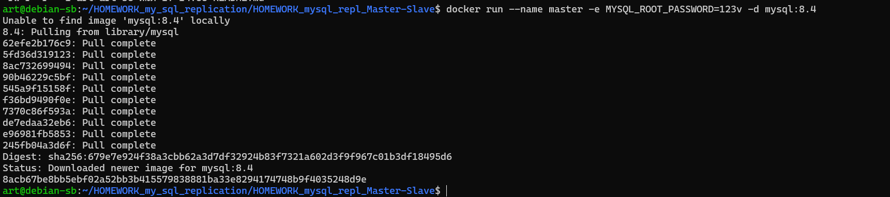
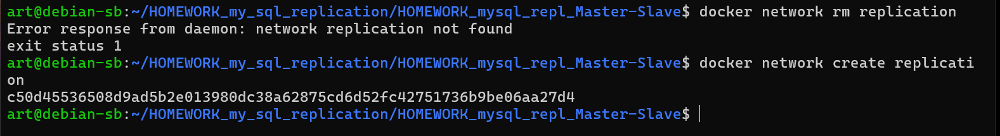
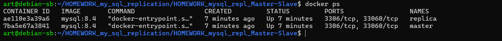
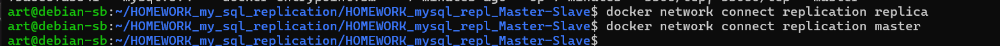
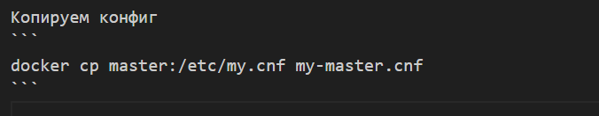
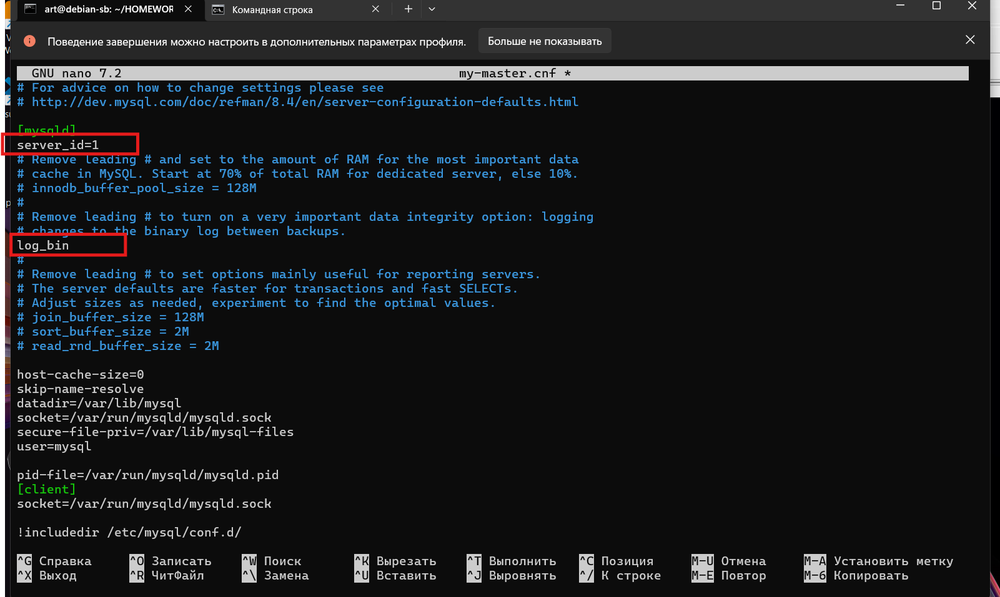
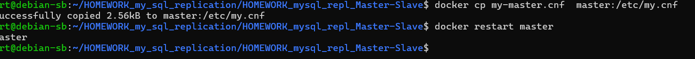
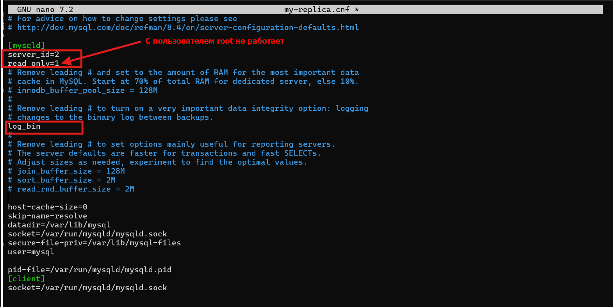

# HOMEWORK_mysql_repl_Master-Slave

## Подготовмм
создадим master 

запустим контейер и назначим пароль
```
docker run --name master -e MYSQL_ROOT_PASSWORD=123v -d mysql:8.4   
```


создадим реплику
```
 docker run --name replica -e MYSQL_ROOT_PASSWORD=123 -d mysql:8.4
```
включим сеть 

```
docker network create replication
```




включим в сеть 

```
docker network connect replication replica
docker network connect replication master
```


-----------------------------------------------------------

crtl+l  - очистить экран

Копируем конфиг
```
docker cp master:/etc/my.cnf my-master.cnf
```

дописываем в my-master.cnf


копируем обратно
```
docker cp my-master.cnf  master:/etc/my.cnf
```


то же самое для реплики

```
docker cp replica:/etc/my.cnf my-replica.cnf
```
