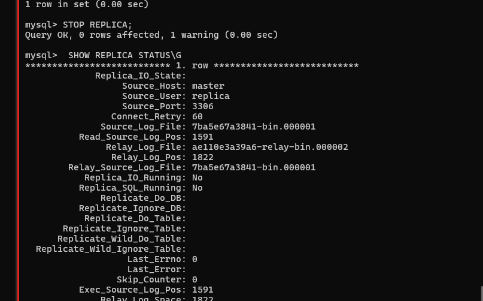
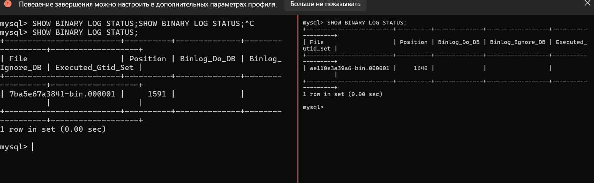
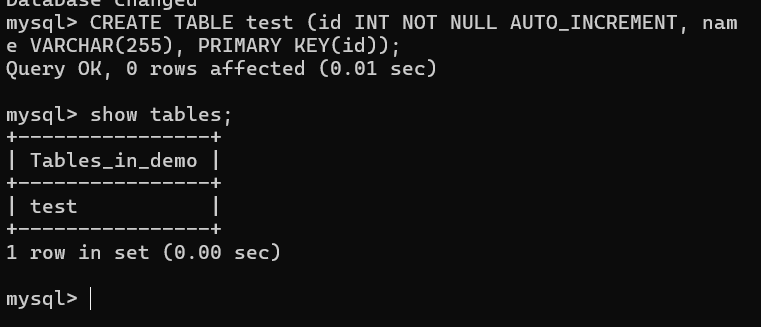
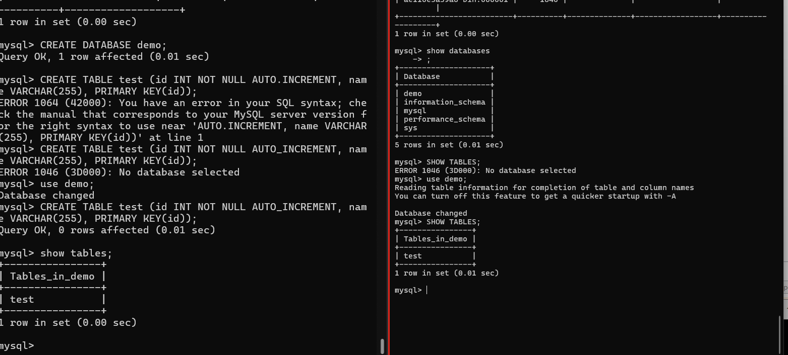
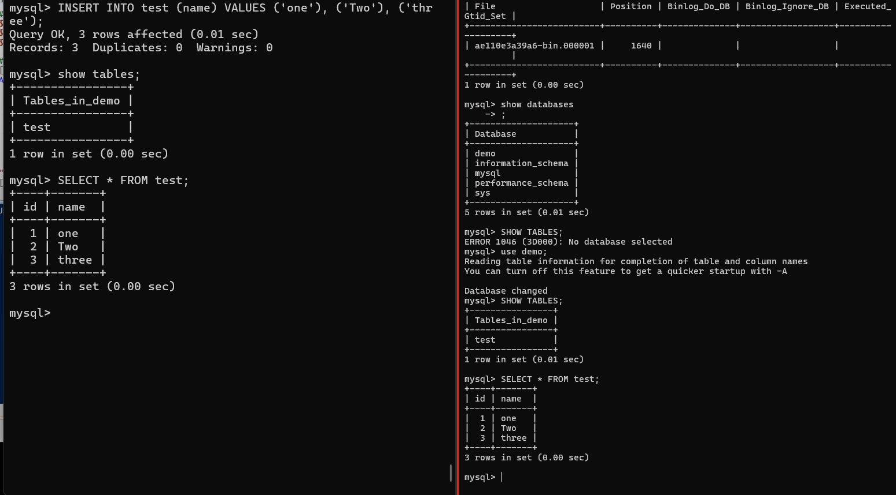

# HOMEWORK_mysql_repl_Master-Slave

## 1: Различия режимов репликации
### Master-Slave репликация
Однонаправленная репликация: данные копируются только от master к slave

Master сервер принимает все операции записи (INSERT, UPDATE, DELETE)

Slave сервер(ы) только читают данные (SELECT)

Если master выходит из строя, требуется ручное переключение на slave

Обычно используется для:

Масштабирования чтения

Резервного копирования

Аналитических запросов

### Master-Master репликация
Двунаправленная репликация: оба сервера могут принимать записи

Каждый сервер является и master и slave одновременно

Изменения на любом сервере реплицируются на другой

Более сложная настройка из-за потенциальных конфликтов

Используется для:

Географического распределения

Повышения отказоустойчивости

Балансировки нагрузки записи

Основные проблемы Master-Master:

Конфликты при одновременном изменении одних и тех же данных

Сложность обеспечения согласованности данных

Требует более тщательного мониторинга

## Задание 2
## Подготовмм
можно скачать готовый

``` git clone https://github.com/ortariot/my_sql_replication.git```
создадим master 

запустим контейер и назначим пароль
```
docker run --name master -e MYSQL_ROOT_PASSWORD=123 -d mysql:8.4   
```


создадим реплику
```
 docker run --name replica -e MYSQL_ROOT_PASSWORD=123 -d mysql:8.4
```
включим сеть 

```
docker network create replication
```


включим в сеть 

```
docker network connect replication replica
docker network connect replication master
```


-----------------------------------------------------------

crtl+l  - очистить экран

Копируем конфиг
```
docker cp master:/etc/my.cnf my-master.cnf
```

дописываем в my-master.cnf


копируем обратно
```
docker cp my-master.cnf  master:/etc/my.cnf
```


то же самое для реплики

```
docker cp replica:/etc/my.cnf my-replica.cnf
```

копируем обратно
```
 docker cp my-replica.cnf  replica:/etc/my.cnf
```
```
docker restart replica
```
подключимся к мастеру:

```
docker exec  -it master mysql -uroot -p123
```


создадим пользователя :
```
CREATE USER 'replica'@'%';
#дадим права репликации на все базы
GRANT REPLICATION SLAVE ON *.* TO 'replica'@'%';
FLUSH PRIVILEGES;
```


НА МАСТЕРЕ
```
SHOW MASTER STATUS;
```
ошибка это норм  ткак это мастер


откуда начинать репликацию
```SHOW BINARY LOG STATUS;```


## на реплике
```
docker exec  -it replica mysql -uroot -p123
```

```
 CHANGE REPLICATION SOURCE TO SOURCE_HOST='master', SOURCE_USER='replica', RELAY_LOG_POS=1591;
```


```
START REPLICA;
```
```
SHOW REPLICA STATUS\G
```


 ```SELECT @@global.read_only;```


``` STOP REPLICA;```



```RESET REPLICA ALL; ``` 
## !! Сбросит все настройки репликации (не запускай)

```
 START REPLICA;
```


``` SHOW BINARY LOG STATUS;```



создадим БД на мастере 

```
CREATE DATABASE demo;
use demo;
CREATE TABLE test (id INT NOT NULL AUTO_INCREMENT, name VARCHAR(255), PRIMARY KEY(id));
show tables;
```




на реплике появилась таблица


```
INSERT INTO test (name) VALUES ('one'), ('Two'), ('thr
ee');
SELECT * FROM test;
```




## Ответ на задание 3*: Настройка Master-Master репликации
Дополнительная конфигурация для Master-Master
На первом сервере:

```
auto_increment_increment = 2
auto_increment_offset = 1
На втором сервере:
```

```
auto_increment_increment = 2
auto_increment_offset = 2

```
Шаги настройки:
На первом сервере (уже настроен как master):
```
SHOW MASTER STATUS;
```
На втором сервере:

```
CHANGE MASTER TO
MASTER_HOST='first_server_ip',
MASTER_USER='replica',
MASTER_PASSWORD='password',
MASTER_LOG_FILE='mysql-bin.000001',
MASTER_LOG_POS=107;
START SLAVE;

```
На втором сервере:
```
SHOW MASTER STATUS;

```
На первом сервере:

```
CHANGE MASTER TO
MASTER_HOST='second_server_ip',
MASTER_USER='replica',
MASTER_PASSWORD='password',
MASTER_LOG_FILE='mysql-bin.000001',
MASTER_LOG_POS=107;
START SLAVE;

```
Проверка:
Создать таблицу на первом сервере - проверить появление на втором

Вставить данные на втором сервере - проверить появление на первом

Проверить статус репликации на обоих серверах:

```
SHOW SLAVE STATUS\G
```