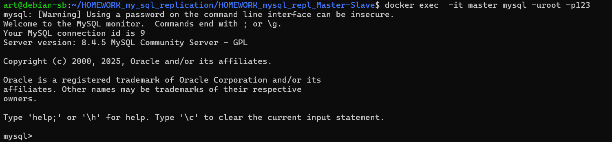
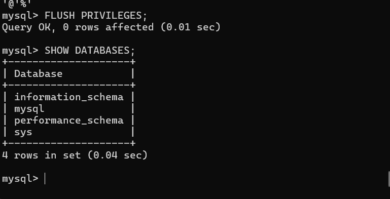
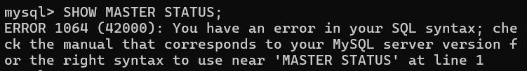
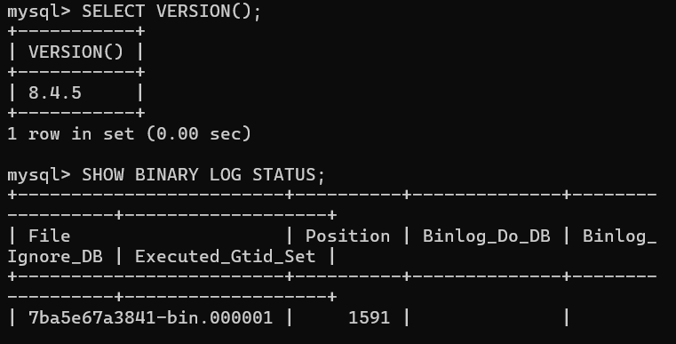
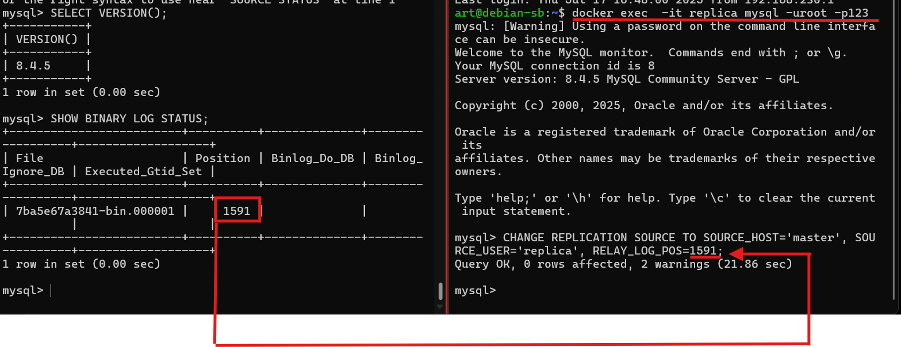
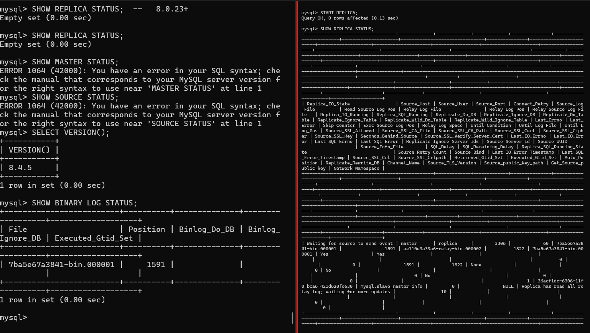
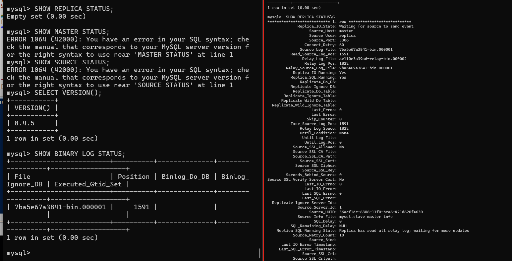
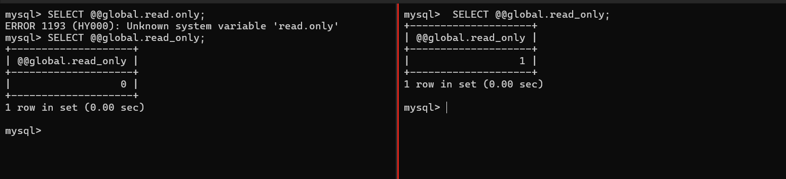

# HOMEWORK_mysql_repl_Master-Slave

## Подготовмм
создадим master 

запустим контейер и назначим пароль
```
docker run --name master -e MYSQL_ROOT_PASSWORD=123 -d mysql:8.4   
```


создадим реплику
```
 docker run --name replica -e MYSQL_ROOT_PASSWORD=123 -d mysql:8.4
```
включим сеть 

```
docker network create replication
```


включим в сеть 

```
docker network connect replication replica
docker network connect replication master
```


-----------------------------------------------------------

crtl+l  - очистить экран

Копируем конфиг
```
docker cp master:/etc/my.cnf my-master.cnf
```

дописываем в my-master.cnf


копируем обратно
```
docker cp my-master.cnf  master:/etc/my.cnf
```


то же самое для реплики

```
docker cp replica:/etc/my.cnf my-replica.cnf
```

копируем обратно
```
 docker cp my-replica.cnf  replica:/etc/my.cnf
```
```
docker restart replica
```
подключимся к мастеру:

```
docker exec  -it master mysql -uroot -p123
```



создадим пользователя :
```
CREATE USER 'replica'@'%';
#дадим права репликации на все базы
GRANT REPLICATION SLAVE ON *.* TO 'replica'@'%';
FLUSH PRIVILEGES;
```


НА МАСТЕРЕ
```
SHOW MASTER STATUS;
```
ошибка это норм  ткак это мастер


откуда начинать репликацию
```SHOW BINARY LOG STATUS;```



## на реплике
```
docker exec  -it replica mysql -uroot -p123
```

```
 CHANGE REPLICATION SOURCE TO SOURCE_HOST='master', SOURCE_USER='replica', RELAY_LOG_POS=1591;
```



```
START REPLICA;
```
```
SHOW REPLICA STATUS\G
```






 ```SELECT @@global.read_only;```



